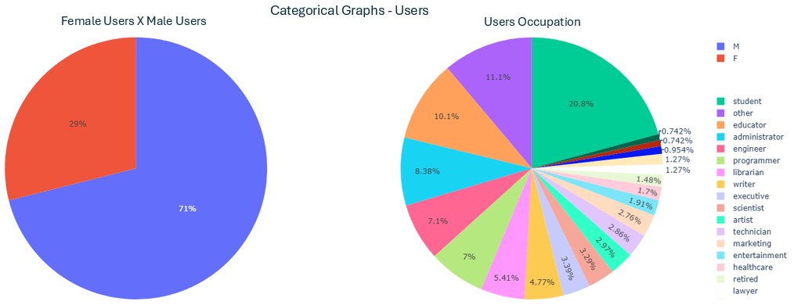
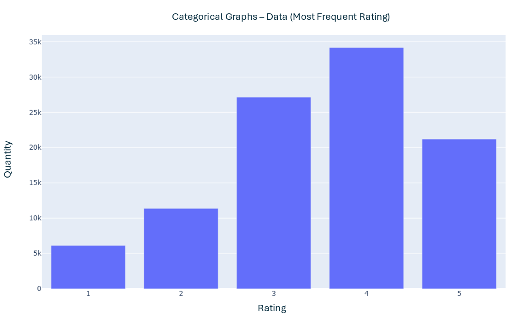
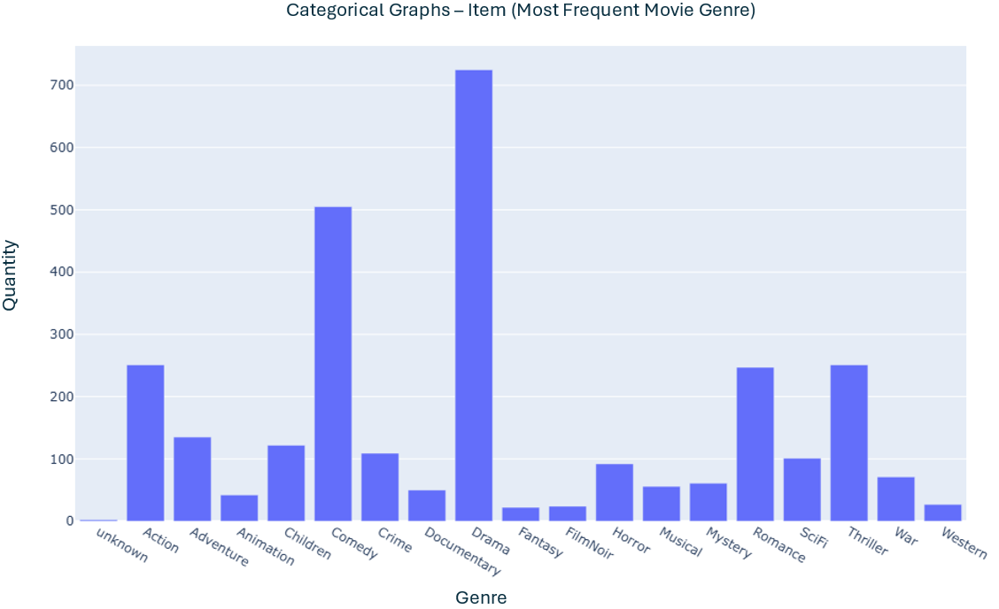
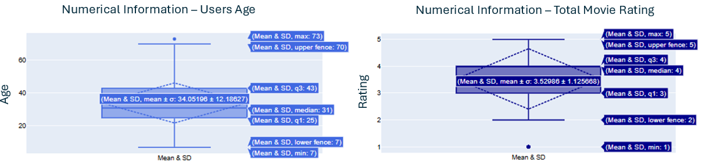
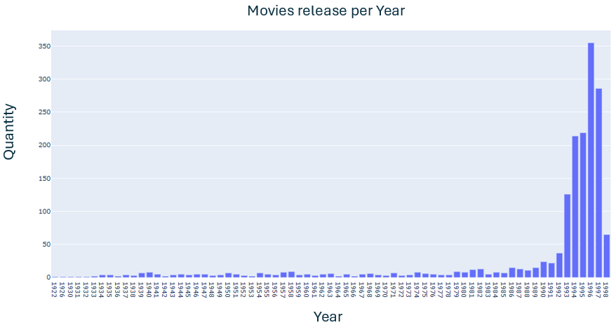
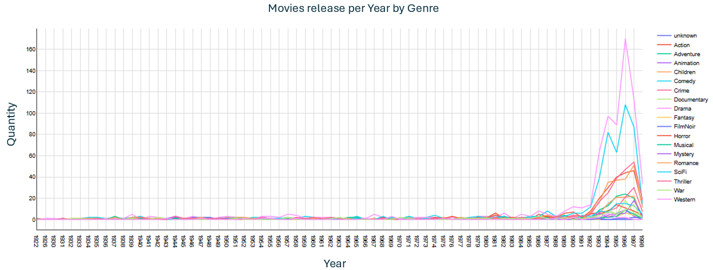
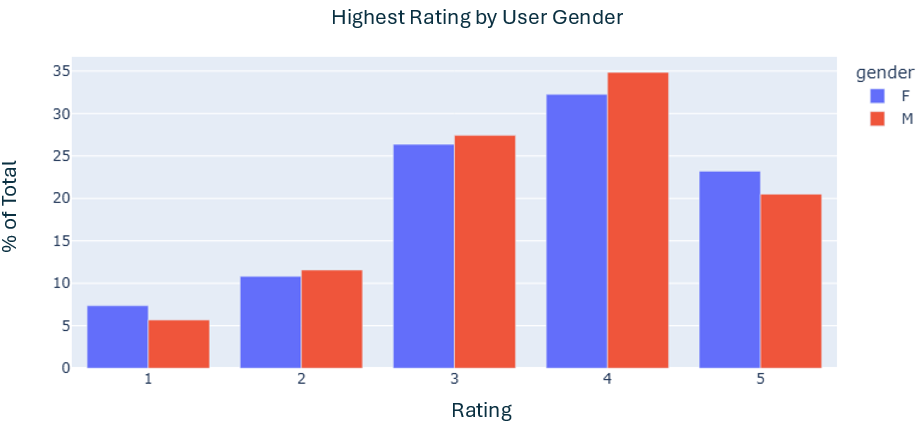
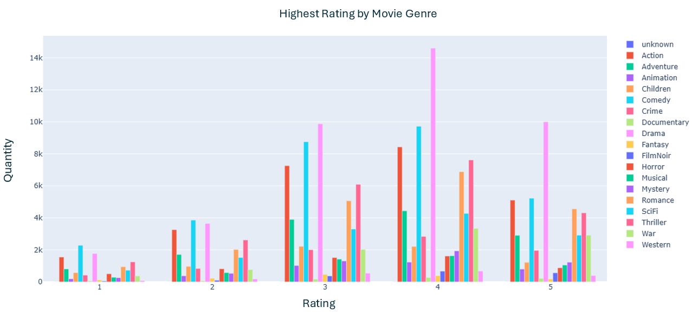

# Plotly & Pandas: Movie Data Visual Analysis
# Links de acesso:
- [Link para acesso ao Google Colab](https://colab.research.google.com/drive/12QTalEdwHfajrw17FiNzaJlCpPPo2y90?usp=sharing)
- Arquivo ".ipynb" para rodar o projeto: plotly_pandas_movies_visual_analysis.ipynb
- [Link de acesso para o portfólio em Inglês](https://meduardaeneves.github.io/portfolio/personal-projects/plotly_pandas_movies_visual_analysis/)

# Objetivos do Projeto

- O projeto tem como objetivo aplicar uma análise descritiva de um "Movie Lens Data"
- Os dados foram coletados por meio do ["Group Lens"](http://files.grouplens.org/datasets/movielens/), através de seus arquivos "movielens" "ml-100k/".
- Os arquivos utilizados durante o projeto foram: u.data; u.item e u.user
- Este Projeto foi desenvolvido durante o curso de Pós-graduação em Deep Learning e como formato de Pergunta e Resposta. Portanto, o projeto foi organizado de forma a responder às questões que foram feitas, utilizando as bibliotecas python PLOTLY e PANDAS.
- Por fim, este projeto teve como objetivo principal desenvolver conhecimento nas bibliotecas PANDAS e PLOTLY

# Desenvolvimento do Projeto

O desenvolvimento técnico deste projeto foi dividido em Carregamento dos Dados, seguido por suas 2 fases (2 questões principais)
1. Apresentação em formato visual (usando Plotly) dos arquivos de Minessota
2. Manipulação de DataFrame usando Pandas

## Carregamento dos Dados
- Para o projeto, os únicos dados necessários foram os três mencionados anteriormente na seção "Objetivo do projeto"
- Os dados contêm classificações de usuários relacionadas a um tipo específico de filme, dentre os treês arquivos csv. As análises feitas estão relacionadas à especificação de cada arquivo e integração entre eles.
- Em cada descrição, há um fragmento exemplificando cada um dos arquivos
- Descrição dos dados:
- u.data: contém a relação entre o usuário, filme e avaliação dada, como: user_id; movie_id; rating; timestamp

| user_id | movie_id | rating | timestamp  |
|---------|---------|--------|------------|
| 22      | 377     | 1      | 878887116  |
| 186     | 302     | 3      | 891717742  |

- u.item: contém informações do filme, tais como: movie_id; movie_title; release_date; video_release_date; IMDb_URL; gênero do filme

| movie_id | movie_title        | release_date | video_release_date | IMDb_URL                                      | unknown | Action | ... | Thriller | War | Western |
|---------|--------------------|-------------|-------------------|----------------------------------------------|---------|--------|-----|----------|-----|---------|
| 1       | Toy Story (1995)   | 01-Jan-1995 | NaN               | http://us.imdb.com/M/title-exact?Toy%20Story%2... | 0       | 0      | ... | 0        | 0   | 0       |
| 2       | GoldenEye (1995)   | 01-Jan-1995 | NaN               | http://us.imdb.com/M/title-exact?GoldenEye%20(... | 0       | 1      | ... | 1        | 0   | 0       |

- u.user: contém as informações do usuário, tais como: user_id; idade; sexo; ocupação; zip_code

| user_id | age | gender | occupation  | zip_code |
|---------|-----|--------|------------|----------|
| 1       | 24  | M      | technician | 85711    |
| 2       | 53  | F      | other      | 94043    |

- Para melhor analisar os dados, nas seguintes etapas, os diferentes arquivos .csv serão unidos pelo ID do usuário ou filme

## Apresentação em formato visual (usando Plotly) dos arquivos de Minessota
### Representação Visual das variáveis categóricas
- u.user (usuários)

- u.data (Avaliação)

- u.item (informações de filmes)

### Representação Visual das variáveis numéricas

### Criação de gráficos temporais relacionados aos dados

### Análise das avaliações (por gênero do usuário e do filme)

## Manipulação de DataFrame usando Pandas
- Esta fase final focou em manipular os DataFrames trabalhando com os elementos da biblioteca Pandas
- A primeira manipulação feita foi a geração de um novo DataFrame com apenas usuários "Masculino" (M) e "Estudante" (student), maiores de 20 anos.
  - Uma função foi aplicada no conjunto de dados USER:
    -   student_users = users[(users.age > 20)&(users.occupation == "student")&(users.gender == "M")]
  - A tabela abaixo apresenta uma fração do novo DataFrame que foi gerado
| user_id | age | gender | occupation | zip_code |
|---------|-----|--------|------------|----------|
| 9       | 29  | M      | student    | 01002    |
| 33      | 23  | M      | student    | 27510    |
| 73      | 24  | M      | student    | 41850    |

- A segunda manipulação foi feita para descobrir a quantidade de mulheres programadoras que existem
  - Uma função foi aplicada no conjunto de dados USER:
    - programmer_F_users = users[(users.occupation == "programmer")&(users.gender == "F")]
  -  Foi encontrado um total de 6 usuários que se encaixam nos critérios
- A última manipulação foi feita para descobrir a quantidade de filmes com classificação acima de 3
  - Uma função foi aplicada no conjunto de dados DATA:
    - over3_data = data[data.rating > 3]
  - Resultados por classificação (4 e 5): Classificação 4 com 34.174 unidades; Classificação 5 com 21.201 unidades
  - Foram encontrados 55.375 filmes com avaliações acima de 3
